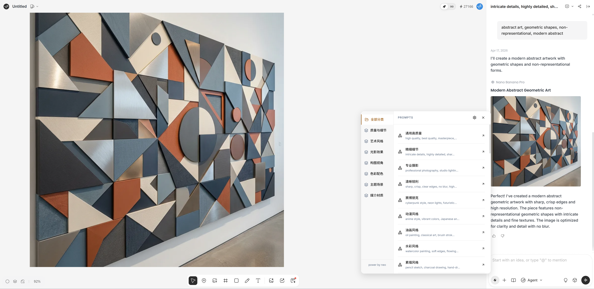
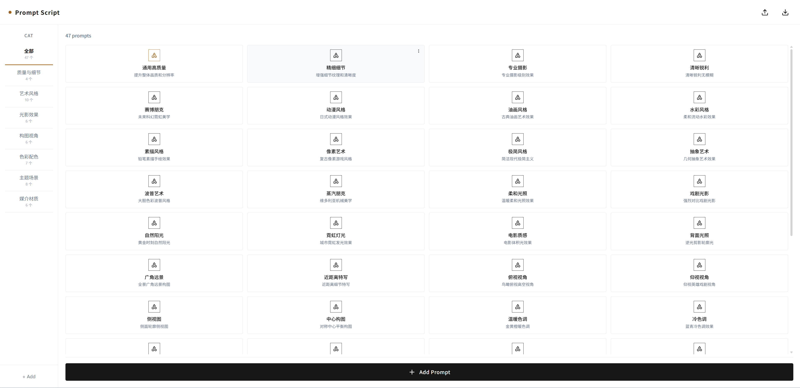

# Prompt-Script

一键插入预设提示词，让 Lovart AI 创作更高效。

## 这是什么？

Prompt-Script 是一个 Chrome 扩展，专为 Lovart AI 设计平台打造。它让你把常用的提示词保存起来，下次创作时一键插入，不再每次都要重新输入相同的内容。

## 解决什么痛点？

每次在 Lovart 创作时，你是否也在重复输入这些内容：
- 常用的风格描述：「扁平化设计」「赛博朋克风格」「水彩插画」
- 技术参数：「高清渲染」「4K分辨率」「光影细腻」
- 自己积累的优质提示词模板

一次输入，下次还得再输。Prompt-Script 让你把这些内容保存下来，需要时点一下就能插入。

## 怎么用？

### 页面上一键插入

在 Lovart 的输入框旁，你会看到一个闪电图标按钮：

1. 点击闪电图标 → 打开下拉菜单
2. 选择提示词 → 内容自动插入到输入框
3. 继续选择 → 可以组合多个提示词

### 管理你的提示词

点击浏览器工具栏的扩展图标，打开管理界面：

- **分类管理**：按用途分组（风格、参数、场景等）
- **增删改查**：添加、编辑、删除提示词
- **导入导出**：JSON 格式备份和迁移数据

## 安装

1. 从 Chrome 商店安装（即将上架）
2. 或手动安装：下载 `dist` 目录，在 `chrome://extensions/` 加载已解压的扩展

## 常见问题

**Q: 为什么在其他网站看不到闪电图标？**

A: 扩展仅在 Lovart 平台激活，避免影响其他网站。

**Q: 如何备份我的提示词？**

A: 在管理界面点击导出图标，下载 JSON 文件保存。恢复时点击导入图标选择该文件。

**Q: 提示词插入后平台没反应？**

A: 确保输入框处于聚焦状态。如有问题，可手动输入几个字符后再插入。

## 许可证

MIT License - 自由使用、修改和分发。